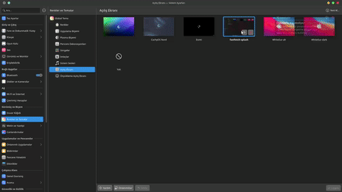
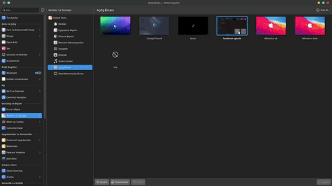

# Fastfetch KDE Splash v1.4

<p align="center">
  
</p>

<div align="center">
  <table>
    <tr>
      <td width="50%">
        
      </td>
      <td width="50%">
        
      </td>
    </tr>
  </table>
</div>
This project is a "hacker/matrix style" splash animation for KDE Plasma that displays real-time system information using the `fastfetch` tool.

[English](README.md) | [Türkçe](README.tr.md)

## 🌟 Features

*   **Color Selection:** Freely choose any theme color you want.
*   **Logo & Info Layouts:** Choose between logo-only or "full" mode with all details.
*   **Background Settings:** Set the background color or make it transparent.
*   **Stylish Animation:** Be greeted by a modern effect where characters appear one by one during system startup.

## 🛠️ Installation and Configuration

### 1. Using the Installation Script (Recommended)

The `install.sh` script automates everything:
*   Asks for your preferences (color, layout, background).
*   Copies files to the correct directory (`~/.local/share/plasma/look-and-feel/fastfetch-splash`).
*   Automatically completes the configuration.

```bash
# to clone the repository
git clone https://github.com/herzane52/fastfetch-kde-splash.git
cd fastfetch-kde-splash
```

```bash
# to give permission to run the installation script
chmod +x install.sh
```
```bash
# to run the installation script
./install.sh
```

### 2. Manual Configuration (Store Users)

If you installed the theme via KDE Store, you will encounter the "Configuration Required" error. To fix this, you can manually edit the following file (see lines 10-13):

```bash
nano ~/.local/share/plasma/look-and-feel/fastfetch-splash/contents/splash/Splash.qml
```

*   Open the `Splash.qml` file.
*   Set `property bool isConfigured` to `true`.
*   Customize `themeColor`, `displayMode`, and `bgColor` values according to your preference.

## 📋 Requirements

*   **KDE Plasma:** Version 5 or 6.
*   **Fastfetch:** Must be installed on your system.
*   **Qt5Compat.GraphicalEffects:** Required for visual effects.

## 🚀 Usage

1.  Open **System Settings**.
2.  Go to the **Appearance > Splash Screen** tab.
3.  Select **fastfetch-splash** from the list and click **Apply**.

## 🛠️ Troubleshooting

*   **"Configuration Required" Error:** This happens when the theme is installed without using the script (`install.sh`). Run the installation script or set `isConfigured` to `true` in `Splash.qml` to fix it.
*   **"'fastfetch' not found" Error:** `fastfetch` is not installed on your system. Install it using your distribution's package manager (e.g., `sudo pacman -S fastfetch` or `sudo apt install fastfetch`).
*   **"'fastfetch' returned empty output" Error:** The command is running but not returning any output. Verify that `fastfetch` works correctly in your terminal.
*   **Visual Glitches/Issues:** If effects (neon glow, glitch, etc.) are invisible, ensure that the `Qt5Compat.GraphicalEffects` package is installed.

## 📄 License

Protected under the MIT License.
