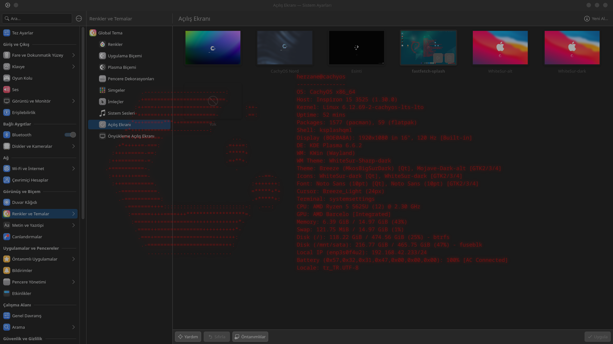

[English](README.md) | [Türkçe](README.tr.md)

# Fastfetch KDE Splash
<p align="center">
  
</p>

<p align="center">
  <video src="video.mp4" width="100%" controls autoplay loop muted></video>
</p>

Bu proje, KDE Plasma masaüstü ortamı için `fastfetch` aracını kullanarak sistem bilgilerini açılış ekranında (Splash Screen) görüntüleyen bir temadır.

## Gereksinimler

*   **KDE Plasma:** 5 veya 6 sürümü.
*   **Fastfetch:** Sisteminizde kurulu ve uçbirimden erişilebilir olmalıdır.
*   **Qt5Compat.GraphicalEffects:** Bazı efektlerin çalışması için gereklidir.

## Teknik Çalışma Mantığı

Tema, QML tabanlıdır ve `Plasma5Support` kütüphanesini kullanarak arka planda `fastfetch` komutlarını çalıştırır. Elde edilen verilerdeki ANSI renk kodlarını temizleyerek ekranda sabit genişlikli (Monospace) bir düzende görüntüler.

## Kurulum

Projeyi klonlayıp kurulum betiğini çalıştırmanız yeterlidir:

```bash
git clone https://github.com/herzane52/fastfetch-kde-splash.git
cd fastfetch-kde-splash
```
```bash
chmod +x install.sh
./install.sh
```

## Kullanım

1. **Sistem Ayarları**'nı açın.
2. **Görünüm > Açılış Ekranı** sekmesine gidin.
3. Listeden **fastfetch-splash** öğesini seçin ve **Uygula**'ya tıklayın.

## Lisans

MIT Lisansı ile korunmaktadır.
